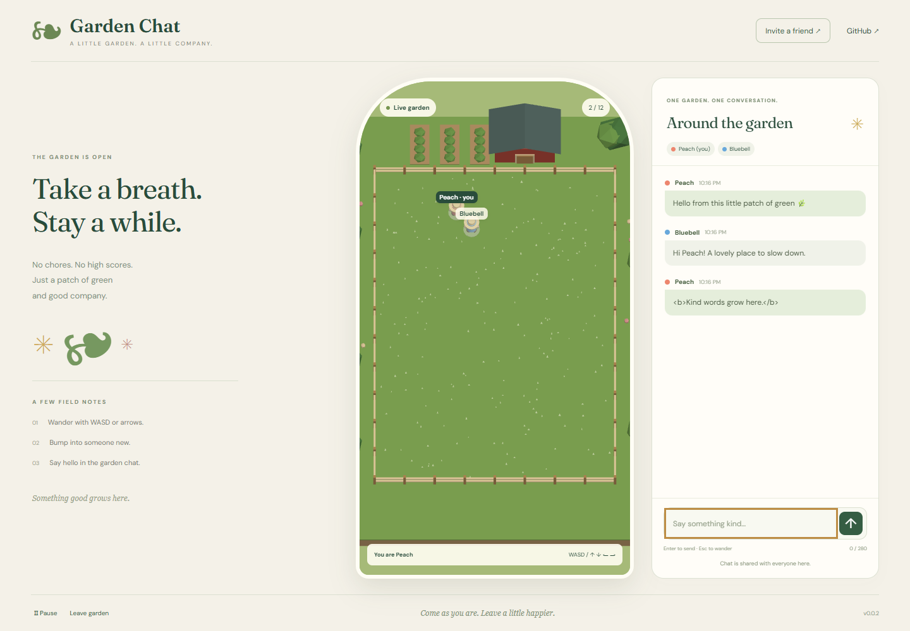

# Garden Chat

A cozy **multiplayer** garden for up to 12 visitors. Wander with WASD, arrows or touch, bump into each other, and share one scrolling conversation. No chores, scores, interior obstacles or win condition.

## Live Demo

[Visit Garden Chat](https://samuelasherrivello.github.io/babylon-lite-garden-chat/)



## Getting Started

Use Node 24 and npm. Run from the repository root:

```sh
npm ci
npm run dev
npm test
npm run build
npm run preview
```

Open the URL printed by Vite. Requires a recent Chrome or Edge with WebGPU and hardware acceleration. Initialization failures show recovery instructions. Optional `.env.local` can set `VITE_SERVER_URL`; see `.env.example`. No credentials belong in the client.

## Controls and Chat

- WASD / arrow keys: move. Touch devices have a directional pad with simultaneous directions.
- Type a message and press Enter or Send. Escape returns focus to the garden.
- Pause stops your movement while everyone else continues. Resume restores controls.
- Leave garden disconnects; Join garden creates a fresh anonymous visitor.
- Invite a friend copies the garden URL.

The server validates movement, bounds and collisions. Input stops on blur, page hiding, pause, text focus or pointer cancellation. Names and colors are automatic. Chat accepts 280 characters per message, with a 750ms rate limit. Scroll upward to read earlier messages; new messages preserve your reading position and expose a jump-to-latest button. Late joiners see the latest 100 messages, including departed authors.

## Multiplayer and Hosting

Uses [RMC Colyseus Multiplayer Server v0.3.0](https://github.com/SamuelAsherRivello/rmc-colyseus-multiplayer-server/releases/tag/v0.3.0), isolated room key `garden-chat`, and the exact `rmc-multiplayer-client-0.3.0.tgz` release asset. Public endpoint: `https://rmc-colyseus-multiplayer-server.vercel.app`. Existing Drawing and Sumo protocols are preserved.

Experimental portfolio hosting: Vercel functions can expire around five minutes. Reconnection uses a fresh identity. Room closure, deployment or instance restart clears in-memory history; separate instances do not share state. There are no accounts, durable chat, private rooms or moderation tools. Chat is public to visitors. Full rooms display an explicit retry option.

## Project Details

`project-name/` remains the Vite application root according to template AGENTS.md; npm configuration stays at the repository root. `src/renderer.js` uses **Babylon Lite 1.32.0**, not full Babylon.js. `src/input.js` holds testable movement mapping; `src/main.js` owns lifecycle and safe text-only DOM chat rendering.

Original farm art was built in Blender through the official MCP using imported Blender skills. [Editable Blender source](project-name/art/garden.blend), [deployed GLB](project-name/public/assets/garden.glb). Trees, crops and barn sit outside the fence. Runtime gardeners wear distinct colors and straw hats. The supplied farm screenshot is visual inspiration, not copied artwork. A generated visual target guided palette review; the README screenshot is the real game.

Both [AI Skills Library](https://github.com/SamuelAsherRivello/ai-skills-library) and [AI Skills Blender](https://github.com/SamuelAsherRivello/ai-skills-blender) are imported as real project-local files. See [provenance](project-name/documentation/provenance.md) and [explore findings](project-name/documentation/exploration.md). Four OpenSpec changes cover multiplayer, garden/input, chat and delivery, each explored and applied. Conflicting template skill baselines are preserved outside discovery.

## Verification and Release

`npm test` checks normalized movement, opposing directions and blocked input. `npm run test:browser` uses Playwright Chromium with WebGPU for independent sessions, keyboard movement, collisions, pause, chat focus, relay, literal HTML, late history, drop/rejoin, scroll preservation and emulated mobile touch. Install its browser with `npx playwright install chromium` if needed. Set `TEST_URL` to test a deployed build; run against a quiet room. Shared-server tests cover 12/13 capacity, invalid payloads, collision/bounds, departure, reconnect and isolation.

The checked-in **Release** workflow installs, tests and builds, increments the patch in `version.txt`, commits/tags, publishes a release and dispatches **Deploy live demo**. GitHub Pages uses `/babylon-lite-garden-chat/`. The displayed version imports `version.txt`, the single version source. See [verification evidence](project-name/documentation/verification.md).

## Original AI Prompt

<details>
<summary>Read the original request and follow-up</summary>

```text
$rmc-game-creator Create a new MULTIPLAYER game in a public repo.

Using this template: https://github.com/SamuelAsherRivello/github-repository-template

Its a farm/garne environment with bounds. but no obstacles. each player can moev with WASD/Keys and bump into each other. then there is one group chat where each person can text to the chain and scroll through the chat history. has hot join and hot drop.

Its called babylon-lite-garden-chat.

Import these codex skills to use to make art https://github.com/SamuelAsherRivello/ai-skills-blender/

This is more of an interactive experience, and less of a 'game' with specific rules.

[Attached: farm reference image.]

Follow-up:
import these skills and use the explore and apply for each major system in the game. https://github.com/SamuelAsherRivello/ai-skills-library/. Optional is to use other skills too.
```
</details>

## Credits


<!-- AI: Preserve established attribution and ownership. Customize the following subsections only from confirmed contributor, contact, and license information; do not infer a new owner from the repository name. -->
### 💡 Contributors

<!-- AI: Preserve existing contributor credit and add contributors only when confirmed. Do not automatically advance experience counts or their reference year. -->
- Samuel Asher Rivello - Over 25 years of game development XP (2026)

### 💡 Contact

<!-- AI: Preserve confirmed contact destinations and their order unless requested otherwise. Use readable display URLs without a protocol or trailing slash while keeping the real link target intact. Do not invent accounts or change target capitalization based on display styling. -->
- [LinkedIn.com/in/SamuelAsherRivello](https://Linkedin.com/in/SamuelAsherRivello) ⭐ 
- [GitHub.com/SamuelAsherRivello](https://github.com/SamuelAsherRivello/)
- [Twitter.com/srivello](https://twitter.com/srivello/)
- Resume / Portfolio: [SamuelAsherRivello.com](http://www.SamuelAsherRivello.com)


### 💡 License

<!-- AI: Keep the license name linked to the actual relative license file and verify that its terms match this statement. Keep the copyright holder and year consistent with that file. Do not change license terms, ownership, or dates without an explicit request. -->
- Provided as-is under the [MIT License](LICENSE).

- Copyright © 2026 Rivello Multimedia Consulting, LLC.
